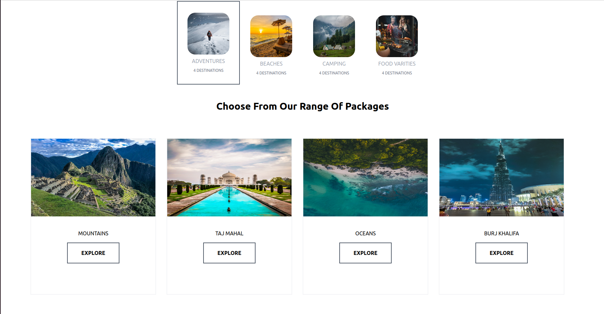

# Responsive-Travel-Website
“The more you practice, the better you get, the more freedom you have to create.” – Jocko Willink

Here is a  responsive travel website with user authentication  build using Laravel,Tailwind CSS,Alpine JS

Travel with Us is a responsive tavel website build on laravel, styled with tailwind CSS with support of user authentication.

  

The website utalizes various CSS concepts coupled with Alpine JS for interactivity.........

  

